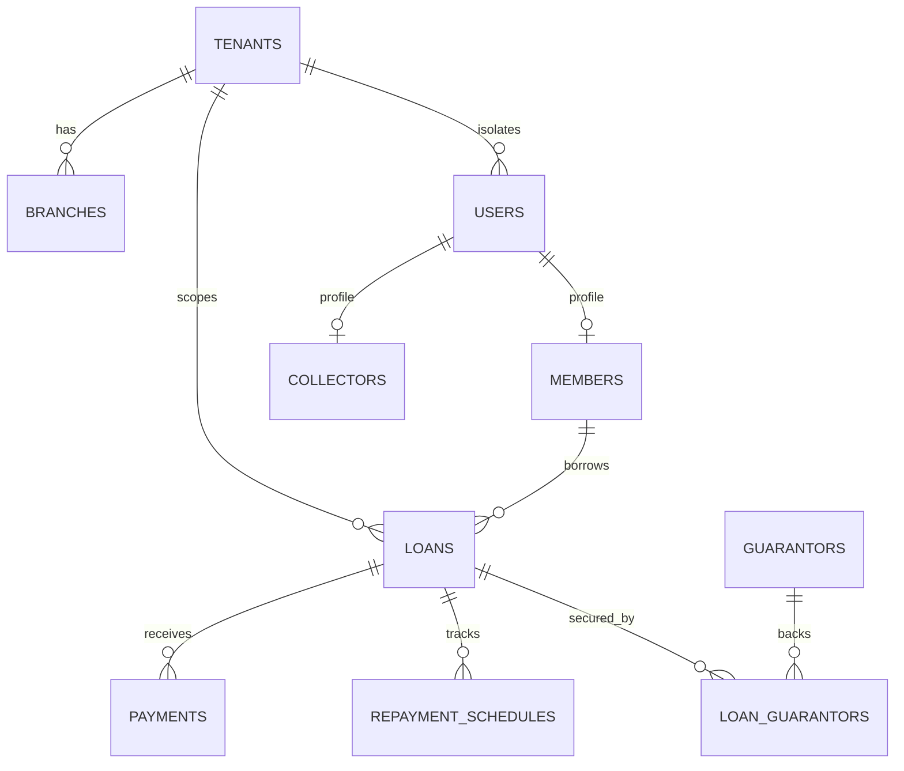

# GBS Loan Management System — Entity Relationship Diagram

```mermaid
erDiagram
  TENANTS ||--o{ BRANCHES : has
  TENANTS ||--o{ USERS : isolates
  TENANTS ||--o{ LOANS : scopes
  USERS ||--o| MEMBERS : profile
  USERS ||--o| COLLECTORS : profile
  MEMBERS ||--o{ LOANS : borrows
  LOANS ||--o{ PAYMENTS : receives
  LOANS ||--o{ REPAYMENT_SCHEDULES : tracks
  LOANS ||--o{ LOAN_GUARANTORS : secured_by
  GUARANTORS ||--o{ LOAN_GUARANTORS : backs
```
